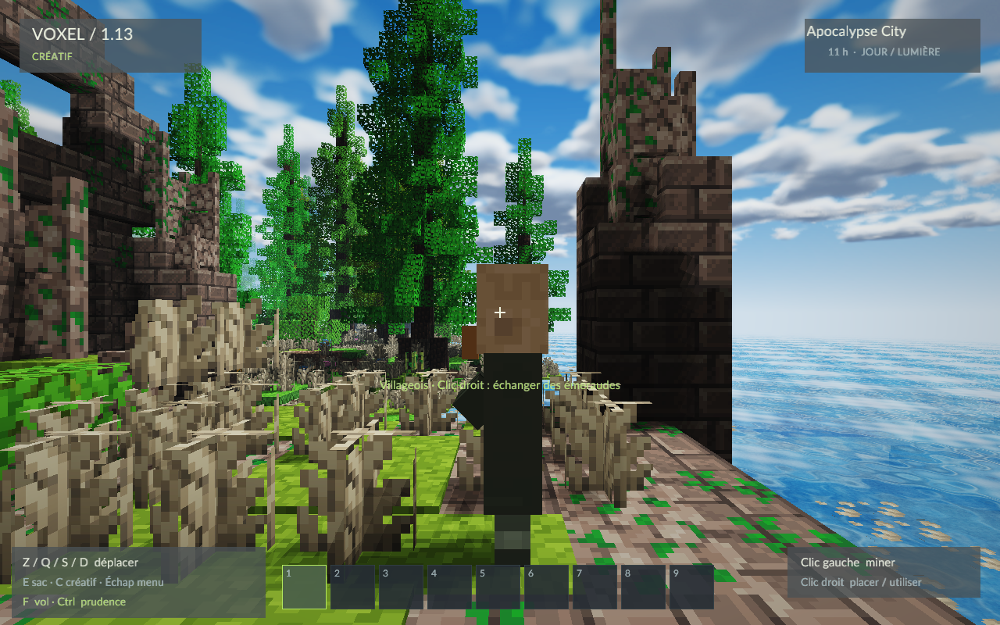
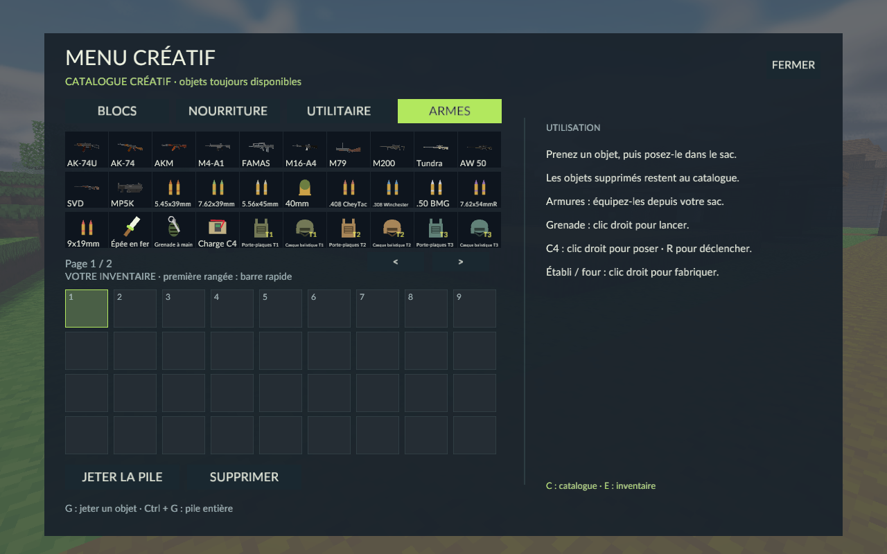

# VOXEL — version 1.13 / Apocalypse City

**Correctifs 1.13 :** mousse opaque, fleurs sans trous dans le terrain et textures ajourées conservant les faces voisines. Le jour dure désormais environ **11 min 12 s**, soit deux fois plus longtemps ; la nuit garde ses **4 min 24 s**. Les sauvegardes existantes restent compatibles.

Jeu solo en 3D pour Windows 64 bits. **Extrayez tout le ZIP**, puis double-cliquez sur **VOXEL.exe** ou **JOUER.cmd**. Choisissez Créatif ou Survie, l’un des **six départs**, puis **Explorer la ville**. La nouvelle partie utilise la map fournie **Apocalypse City v1.32**, sans génération de terrain ni de nouveaux villages. Aucun compte ou outil de développement n’est nécessaire.

Les départs sont **Entrée est, Quartier ouest, Hauteurs nord, Quartier nord, Centre-ville et Entrée sud**. Chaque partie commence avec **un sac, une barre rapide et un équipement vides**. Votre choix devient le point de réapparition ; un lit valide le remplace. Reprendre conserve votre position, vos objets et vos modifications.

La ville a sa propre sauvegarde **saves/apocalypse-city.json**. Vos anciens **world.json/world.bak** et les archives précédentes restent intacts. Une nouvelle partie remplace la sauvegarde de la ville : copiez le dossier saves pour garder plusieurs parties.



## Inventaire, créatif et fabrication

**E ouvre le sac ; C ouvre le catalogue en créatif.** Dans le sac, la seule recette personnelle est **l'établi : quatre blocs de bois brut**. Posez-le et faites clic droit dessus pour fabriquer les autres objets. Clic droit sur un four ouvre son menu de cuisson. Une station doit rester présente et à portée d'interaction ; simplement posséder un établi dans le sac ne suffit pas. Ctrl + clic droit permet de placer contre une station.

Le catalogue propose quatre onglets, avec des flèches lorsque plusieurs pages sont nécessaires :

- **Blocs** : tous les blocs, eau, lave, cultures et lit.
- **Nourriture** : pomme, pain, bœuf, mouton et porc, chacun cru ou cuit avec une texture différente.
- **Utilitaire** : établi, four, lit, coffres, portes, seaux, outils, graines et matériaux.
- **Armes** : douze armes, neuf calibres, épée, porte-plaques et casques tiers 1–5, grenade à main et C4. Les armures supérieures se trouvent sur la deuxième page.

En créatif, clic prend un objet du catalogue, clic droit une seule unité, Maj-clic l'ajoute au sac. Les armes arrivent chargées. Dans le sac, clic gauche prend, pose, fusionne ou échange les piles ; clic droit prend la moitié ou pose une unité ; Maj-clic transfère entre sac et barre rapide. Survoler une case puis appuyer sur 1–9 l'échange avec la case rapide correspondante. Les infobulles expliquent les objets et boutons.

**Supprimer** efface la pile tenue, ou la case rapide sélectionnée si le curseur est vide. Pour supprimer un objet du sac, prenez-le puis cliquez sur ce bouton. Il reste toujours disponible dans le catalogue créatif.

**G** jette une unité ; **Ctrl + G** ou Jeter la pile jette tout. Approchez-vous après une seconde pour ramasser. Les piles tombent avec collision ; un mur bloque le ramassage et un sac plein les laisse au sol. Les armes conservent chargeur et optique. Les viandes jetées ont aussi leurs textures distinctes. La pause arrête les objets et leur état est sauvegardé. La limite de 1 024 piles empêche toute perte quand elle est atteinte.



## Armes

| Arme | Calibre | Chargeur | Modes |
|---|---|---:|---|
| AK-74U | 5.45×39 mm | 30 | Auto, semi, rafale de 3 |
| AK-74, crosse en bois | 5.45×39 mm | 30 | Auto, semi, rafale de 3 |
| AKM | 7.62×39 mm | 30 | Auto, semi, rafale de 3 |
| M4-A1 | 5.56×45 mm | 30 | Auto, semi, rafale de 3 |
| FAMAS | 5.56×45 mm | 25 | Auto, semi, rafale de 3 |
| M16-A4 | 5.56×45 mm | 30 | Semi et rafale de 3 uniquement |
| M79 | Grenade 40 mm | 1 | Un coup, ouverture du canon pour recharger |
| M200 Intervention | .408 CheyTac | 7 | Verrou |
| Tundra, modèle L96A1/Arctic Warfare | .308 Winchester | 5 | Verrou |
| AW50 | .50 BMG | 5 | Verrou |
| SVD | 7.62×54 mm R | 10 | Semi |
| MP5K | 9×19 mm | 30 | Auto, semi, rafale de 3 |


**Clic gauche** tire, **clic droit maintenu** vise, **R** recharge, **B** change le mode, **I** inspecte. **O** change les lunettes ×4 / ×8 / ×12 des snipers. Les optiques modifient la caméra et la sensibilité. Chaque modèle téléchargé possède sa silhouette, ses pièces mobiles, ses prises en main, son recul, ses rechargements et ses animations. Le MP5K remplace le VPO des anciennes parties en conservant ses cartouches ; les crédits expliquent les modèles et leur identification.

Les chargeurs et réserves respectent le calibre. Changer d'arme annule un rechargement sans consommer sa réserve. Les armes fabriquées arrivent vides ; le créatif recharge sans réserve. La M16 utilise uniquement semi et rafale de trois. Les fusils à verrou attendent leur cycle et un nouveau clic. Courir abaisse l'arme et suspend le tir. Un canon dépassant un mur ne permet pas de tirer au travers.

**Tous les calibres cassent le verre.** L'**AW50 (.50 BMG)** et le **M200 (.408 CheyTac)** cassent aussi troncs, planches, établi, lit, coffre et porte. La balle s'arrête au premier impact ; la pierre reste intacte. Un coffre détruit laisse tomber son contenu. Le M79 lance une grenade avec gravité et collisions continues ; elle explose à l'impact et creuse le terrain.

Chaque arme possède quatre sons stéréo originaux : tir, ouverture, insertion et verrou, synchronisés avec les animations. Les 48 sons utilisent claquement, basses, mécanismes et réverbération. M200, Tundra et AW50 ont des attaques plus fortes et des traînes de 6,4 / 5,8 / 7,6 secondes ; le SVD a une traîne de 3,9 secondes. Une marge de niveau évite la saturation du mélange. Les sons peuvent être coupés dans les réglages.

## Armures et explosifs

Les **porte-plaques et casques balistiques** ont cinq tiers. Déposez une armure dans son emplacement du sac, utilisez Équiper ou faites clic droit avec l'objet sélectionné. Maj-clic sur l'emplacement la remet dans le sac si une case est disponible. Le remplacement restitue l'ancienne armure sans perte. Chaque tier du porte-plaques réduit les dégâts de combat de 10 %, chaque tier du casque de 5 % : le couple de tier 5 protège de **75 %**. La lave, les chutes et la faim restent dangereuses. L'équipement est sauvegardé et conservé à la réapparition.

**Grenade à main : clic droit pour lancer.** Elle rebondit et explose après 3,2 secondes de jeu actif. Elle tue un villageois exposé à trois blocs : 56 dégâts au maximum, décroissance jusqu’à 6,5 blocs et cratère de 2,7 blocs. Un mur ou une armure réduit les dégâts ; restez à distance en survie. **C4 : clic droit sur une surface pour poser ; R pour déclencher les charges proches**, avec C4 sélectionné ou les mains libres, même après avoir posé la dernière charge. En survie, une utilisation consomme un objet ; en créatif la réserve est infinie. Les armures et explosifs ont des recettes à l'établi.

Les explosions projettent débris, feu, poussière et fumée, avec secousse et sons graves distincts. Les dégâts diminuent avec la distance ; un mur réduit fortement les dégâts avant sa destruction. Bedrock et fluides restent intacts. La fumée respecte la profondeur du terrain. Pause et zones non chargées suspendent les mèches ; grenades en vol et C4 posé sont sauvegardés. Les charges éloignées restent en place jusqu'au retour du joueur.

## Villages, créatures et survie

Les **69 344 chunks originaux** sont importés, avec la ville, les terrains environnants, les sous-sols, les routes et les bâtiments. La zone va de X −2112 à 2207 et de Z −2176 à 2335. Les coordonnées verticales d’origine −64 à 319 sont conservées avec un décalage interne de 64 ; le jeu dispose de 384 niveaux. Les maisons et le relief ne sont pas reconstruits ou aplatis.

Les dalles, escaliers, portes, trappes, barrières et vitres ont des formes et collisions adaptées. **Clic droit sur une porte** l’ouvre ; casser une porte détruit ses deux moitiés. Les petites marches se franchissent automatiquement. Sur une **échelle**, maintenez Espace ou avancez pour monter, et Ctrl pour descendre avec les commandes par défaut.

Les **1 311 coffres et tonneaux** de la map deviennent des conteneurs persistants. Les objets pris en charge sont importés ; les tables de butin Minecraft sont remplacées par des ressources et parfois une AK-74U avec ses munitions. Un coffre vidé ne se remplit pas en le rouvrant. Sa destruction libère son contenu. Les créatures prises en charge sont chargées près du joueur ; les six districts disposent de points de commerce et de protection, sans modifier les constructions.

- **Coffres** : clic droit ouvre 27 cases. Maj-clic transfère ; Tout prendre conserve ce qui ne tient pas dans le sac. Le contenu et les coffres vides sont sauvegardés.
- **Villageois** : clic droit ouvre les échanges de blé, émeraudes, pain, fer ou épée. Un achat ne consomme rien si l'objet ne tient pas dans le sac.
- **Golems** : poursuivent et attaquent les monstres ; les villageois fuient les zombies. Les attaques ne traversent pas les murs.
- **Animaux** : les moutons donnent du mouton et de la laine, les vaches du bœuf, les cochons du porc. Trois viandes crues et un charbon cuisent au four. Les variantes cuites restaurent 8 / 10 / 9 points de faim ; les variantes crues 3.
- **Élevage** : nourrissez deux adultes de même espèce avec du blé. Parents et petits attendent trois minutes de jeu actif avant nouvelle reproduction ou croissance.
- **Monstres** : zombies et creepers apparaissent près du joueur. Les zombies brûlent au soleil ; les creepers explosent après 1,5 seconde près du joueur en survie. Éloignez-vous pour interrompre leur activation.
- **Portes** : clic droit ouvre ou ferme. Maintenir le clic ne les fait pas clignoter. Ctrl + clic droit place contre la porte.
- **Seaux** : clic droit recueille une source puis la verse contre un bloc ; un simple écoulement ne remplit pas le seau.

Les sept modèles animés viennent d'internet : mouton, zombie, villageois, golem, creeper, vache et cochon. Sources et licences sont incluses dans [les crédits des créatures](assets/mobs/SOURCES.md). Leurs corps restent opaques et leur état est sauvegardé.

## Commandes

| Action | Touche par défaut |
|---|---|
| Déplacement | ZQSD en AZERTY ; WASD en QWERTY ; flèches |
| Sauter / nager / monter | Espace |
| Courir / prudence ou descendre en vol | Maj gauche / Ctrl gauche |
| Miner / attaquer / tirer | Clic gauche |
| Placer / utiliser / manger / viser | Clic droit |
| Inventaire / catalogue créatif | E / C |
| Fabrication / cuisson | Clic droit sur établi / four |
| Recharger ou déclencher C4 / mode / inspection / lunette | R / B / I / O |
| Jeter une unité / la pile | G / Ctrl + G |
| Case rapide | 1–9, pavé numérique ou molette |
| Vol créatif / copier le bloc / retirer un fluide | F / clic molette ou V / X |
| Pause / sauvegarde | Échap / F5 |
| Aide / informations / plein écran | F1 / F3 / F11 |

Échap → Commandes & souris permet de changer les touches, sensibilité, axe vertical, course maintien/bascule et shaders. Les préférences sont sauvegardées ; les conflits échangent les commandes. Les menus restent ouverts jusqu'à une nouvelle action. Après un menu ou Alt-Tab, relâchez le clic avant de miner ou tirer. Le premier mouvement de souris après reprise ou redimensionnement est ignoré.

## Construction, agriculture et lit

Récoltez quatre blocs de bois brut, fabriquez l'établi dans E et posez-le pour fabriquer planches, bâtons, outils et four. Le fer exige une pioche en pierre ou fer. Les recettes se répartissent sur plusieurs pages. La cuisson est immédiate et les outils n'ont pas d'usure.

L’exploration suit le terrain original de la map. Le catalogue créatif inclut ses matériaux, en plus des blocs et objets existants. Les matériaux importés servent aux recettes ; casser leurs minerais, arbres et cultures fournit les ressources du jeu.

La houe laboure terre et herbe ; les graines se plantent dans la terre labourée. Eau à moins de quatre blocs et lumière font grandir les cultures par quatre stades. Le blé mûr donne blé et graines ; trois blés fabriquent un pain. Mangez avec clic droit quand vous avez faim. Le lit fixe la réapparition ; la nuit, il avance au matin et restaure la vie. Un lit détruit renvoie au point initial.

## Fluides, textures et shaders

Eau et lave tombent, s'étendent avec des niveaux de surface et se retirent quand leur source disparaît. Eau : sept cellules horizontalement ; lave : trois. L'eau solidifie une source de lave en pierre, un écoulement en pavés. Les fluides respectent les murs et la profondeur ; les menus suspendent leur simulation.

Le nouveau rendu s'inspire de la référence fournie : **ciel atmosphérique, soleil rond, nuages volumétriques animés et coucher de soleil chaud**. L'eau utilise vagues, Fresnel, reflets du ciel et des berges au niveau de la mer. Terrain, maisons et créatures projettent de vraies ombres filtrées. Feuilles et blé bougent par rafales avec leurs ombres. Occlusion locale, brume, bloom, lissage et courbe filmique terminent le rendu. Le mode classique reste disponible dans les réglages.

Les blocs, établi, four, coffre, porte et viandes utilisent **Pixel Perfection Community Edition**, un pack communautaire pour Minecraft, avec [crédits et licence CC BY-SA 4.0](assets/blocks/SOURCES.md). Ce ne sont pas les textures officielles de Mojang. Les formes et UV sont adaptés au moteur ; les coffres et portes ne cachent plus les faces du terrain voisin.

Le rendu ne reproduit pas intégralement un pack de shaders Minecraft. Les reflets des berges utilisent un plan au niveau de la mer ; les autres fluides gardent le ciel comme reflet. Carte d'ombres 1 024 × 1 024, sans ray tracing. Les surfaces transparentes sont triées par chunk. La qualité et la vitesse dépendent du GPU.

## Sauvegardes et sources

**saves/apocalypse-city.json**, à côté du programme, conserve les modifications de la map, les fluides, le sac, les armes, les chargeurs, les optiques, les armures, les objets jetés, les coffres, les créatures, le lit, le joueur, le mode, l’heure, les grenades en vol et le C4 posé. **apocalypse-city.bak** garde la version précédente. Sauvegarde automatique après soixante secondes actives, F5 ou en quittant via le menu. Les anciens formats de sauvegarde restent lisibles par le moteur ; la nouvelle interface reprend uniquement la partie de la ville.

Il existe un seul emplacement de sauvegarde. **Copiez le dossier saves avant de créer un autre monde.** settings.json garde les préférences séparément. Les vérifications utilisent des fichiers isolés ; l'archive ne contient aucune sauvegarde personnelle.

Le dossier de développement local contient Rust, les assets et Cargo.lock. Rust assure le moteur et les règles ; Python prépare modèles, sons et textures. Avec Rust stable et les outils C++/SDK Windows : cargo run --release, cargo test, cargo clippy --all-targets -- -D warnings.

L'archive prête à jouer contient programme, guide, crédits, captures, sons et sources GPL des créatures. Les fichiers isolés AW50 restent privés conformément à leur licence Free Standard. Les autres armes sont CC BY 4.0 ; [crédits et modifications](assets/weapons/real/SOURCES.md) identifient chaque modèle. Le modèle publié AW50 contient aussi des références VictusXMR : son identification dépend de la fiche de l'auteur. Code et sons originaux MIT ; Lato SIL OFL ; licences des modèles et textures distinctes.

Le [rapport de vérification](VERIFICATION.md) détaille les contrôles. Exemple sans toucher à votre monde :

```powershell
.\VOXEL.exe --smoke --legacy-fixture --screen sunset --save-path test-world.json --capture coucher.png
.\VOXEL.exe --smoke --legacy-fixture --v110-checks --sound-checks --save-path test-world.json --report tests.json
.\VOXEL.exe --smoke --shader-checks --occlusion-checks --save-path test-world.json
```

Pour la ville : `--smoke --city-checks --spawn 0` (départs 0 à 5). Les anciennes scènes de vérification nécessitent `--legacy-fixture`. Chaque contrôle rend 180 images puis quitte. --inventory-tab 0–3 sélectionne un onglet créatif ; --inventory-page 1 montre sa deuxième page ; --size 960x600 change la taille. --gun 0–11 sélectionne une arme ; --aim et --optic 0–2 montrent ses lunettes. --screen shore, sunset, shore-night, stations, grenade, c4, inventory, creative, village, desert, church, forge, inn, mountain, cave, mobs, chest, trade et fluids montrent les scènes. --input-checks, --weapon-checks, --reload-checks, --gameplay-checks, --npc-checks, --grenade-checks, --mob-checks et --sound-checks vérifient les systèmes correspondants.

Ce jeu original n'est pas affilié à Mojang. Multijoueur, redstone, autres dimensions et enchantements ne sont pas implémentés. La map dispose de 384 niveaux. Les blocs et objets Minecraft sans équivalent utilisent une adaptation visuelle ou une ressource de remplacement ; les datapacks, commandes, redstone, autres dimensions et entités non prises en charge ne sont pas exécutés. Le déplacement des créatures est simple. Les valeurs des armes, protections, recettes et explosions sont des règles de jeu, pas une simulation militaire réelle.


## Fichiers de la map et performances

**Gardez assets/maps/city.bin et city.json à côté de l’exécutable**, dans leur dossier. Les chunks sont décompressés près du joueur ; les modifications sont enregistrées séparément, sans réécrire la map. Les collisions, tirs, explosions, objets jetés, fluides, ombres, feuillage et reflets fonctionnent aux altitudes de la ville. Les vitres importées se brisent avec tous les calibres ; les .50 BMG et .408 CheyTac cassent le bois. Les portes métalliques résistent à ces balles.

Les textures de la map sont adaptées du pack communautaire Pixel Perfection CE ; les matériaux récents peuvent être approximés. Provenance et licence : [sources de la map et des textures](assets/maps/SOURCES.json), [licence des textures](assets/maps/LICENSE-textures.md). Ce moteur reprend les mécaniques de VOXEL ; il n’exécute pas une sauvegarde Minecraft avec toutes ses règles.

Avec les shaders et une distance de six chunks, les six scènes testées en version 1.12 tournent à environ **26–71 FPS sur la machine de développement**. Le centre est le plus dense. Réduisez la distance dans les réglages ou désactivez les shaders pour gagner des images par seconde. Les résultats dépendent de votre matériel. Aucun long parcours manuel ni second PC/GPU n’a été vérifié.
